# Diagram Arsitektur & Workflow — Aplikasi Informasi Warga "WargaKu"

Project PBL-TRPL102 | RT 04 | Laravel 12 + MySQL | Format: Mermaid
Disinkronkan dengan: `DB_WAR.dbml` (7 tabel), laporan RPL-102 (revisi 1), dan `PRD_WargaKu.md` v2.6 (2026-10-02). Jika ada pertentangan, urutan prioritas mengikuti PRD Bagian 0.1; diagram ini hanya ilustrasi alur.

Daftar isi: (1) Arsitektur, (2) Aktor & fitur, (3) ERD 7 tabel, (4) State pengajuan, (5) State status warga, (6) Registrasi, (7) Perubahan data & verifikasi, (8) Transfer kepemilikan akun, (9) Autentikasi, (10) Surat, (11) Iuran, (12) Catatan sinkronisasi.

---

## 1. Arsitektur Sistem

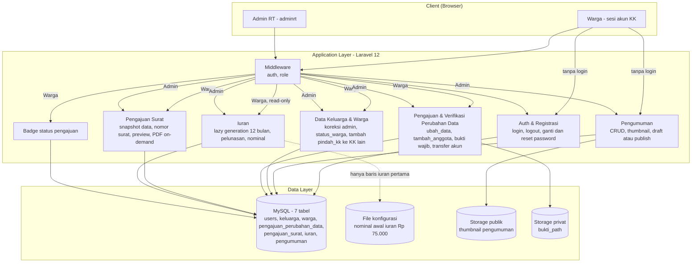

---

## 2. Aktor & Fitur

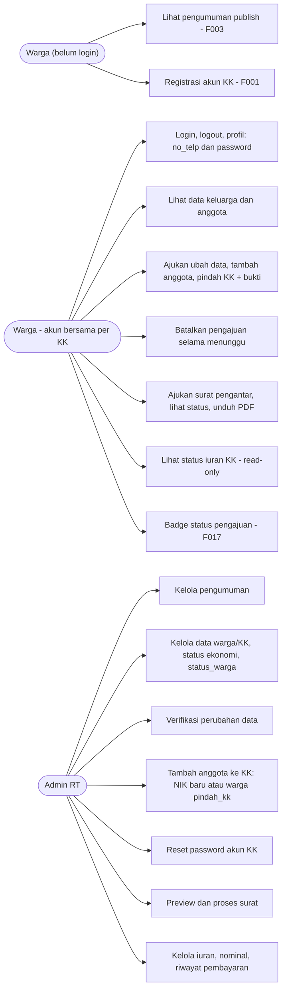

---

## 3. ERD — 7 Tabel

> Semua tabel punya `created_at` dan `updated_at` (tidak digambar). Constraint tambahan: `iuran` unique `(no_kk, bulan, tahun)`; index `warga(no_kk)` dan `warga(status_warga)`.

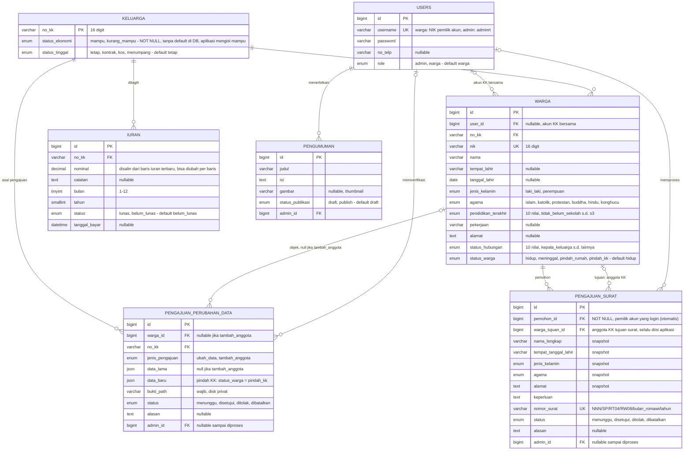

---

## 4. State Machine — Status Pengajuan

Berlaku untuk `pengajuan_perubahan_data` dan `pengajuan_surat`.

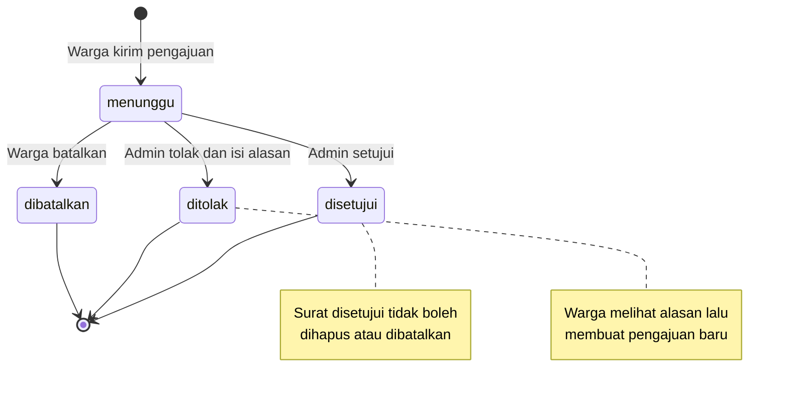

---

## 5. State Machine — Status Warga

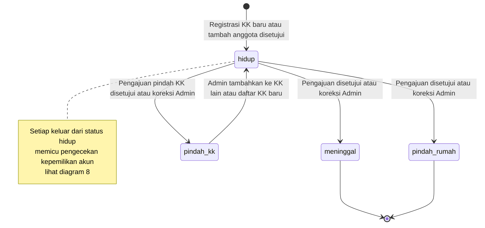

---

## 6. Workflow Registrasi Akun KK (F001)

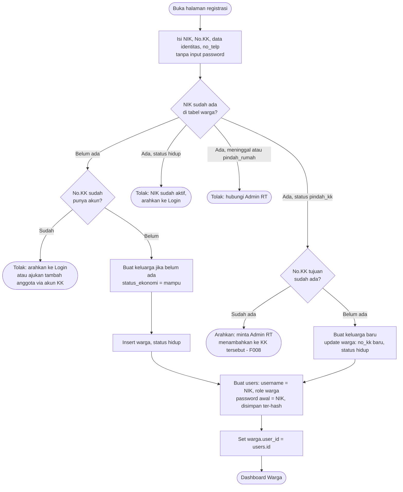

---

## 7. Workflow Perubahan Data & Verifikasi (F006, F007, F008)

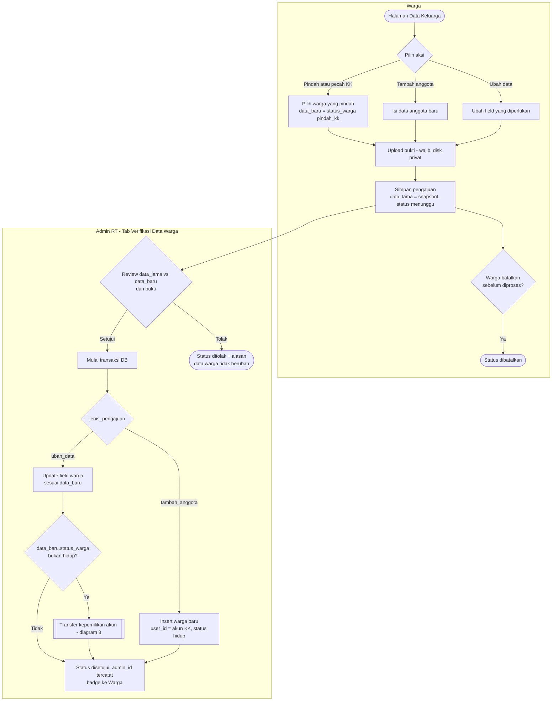

---

## 8. Workflow Transfer Kepemilikan Akun

Business rule backend pada Verifikasi Perubahan Data (F008 / UC-11). Dipicu setiap kali `status_warga` seorang warga berubah dari `hidup` ke status lain (pindah_kk, meninggal, pindah_rumah), baik lewat pengajuan disetujui maupun koreksi Admin. Pemilik akun = warga dengan `nik` sama dengan `users.username`. Seluruh anggota KK berbagi `warga.user_id` yang sama.

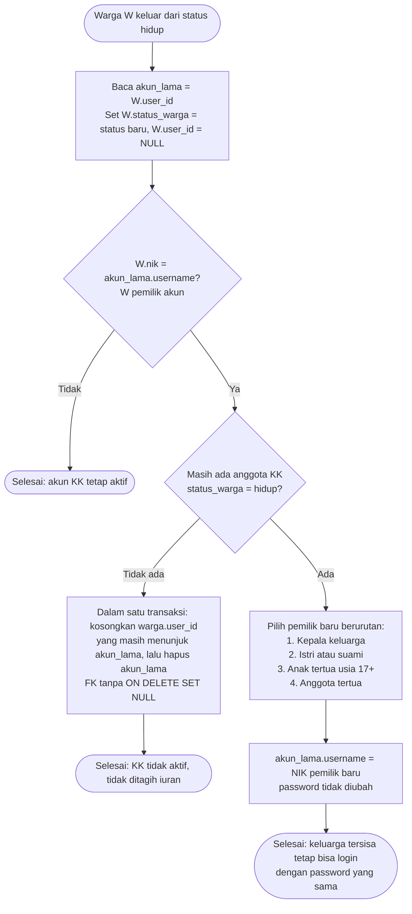

---

## 9. Workflow Autentikasi & Reset Password

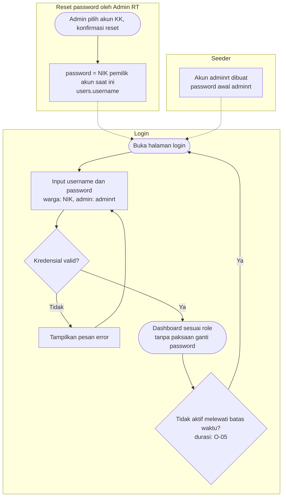

Tidak ada lupa-password lewat email; warga yang lupa meminta Admin RT melakukan reset.

---

## 10. Workflow Pengajuan Surat Pengantar (F011–F013)

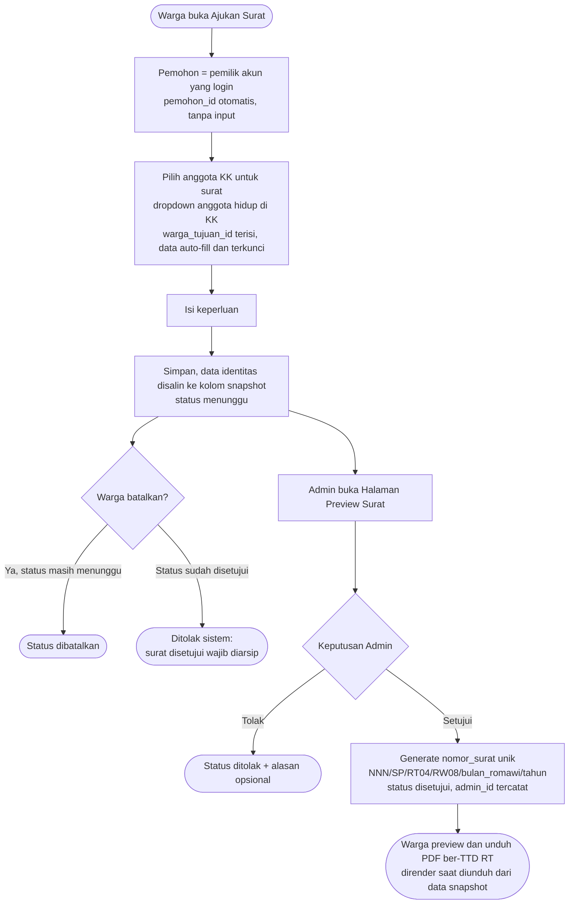

---

## 11. Workflow Iuran & Pengaturan Standar (F009, F012)

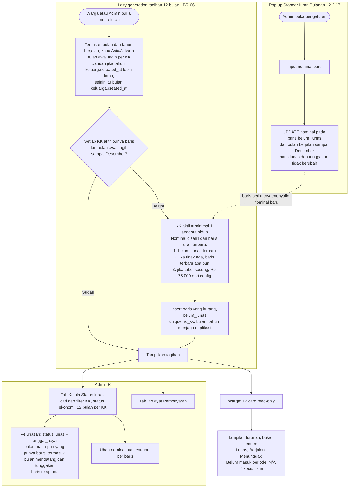

---

## 12. Catatan Sinkronisasi

Diagram ini sudah disamakan dengan `DB_WAR.dbml` (7 tabel, tanpa perubahan skema) dan PRD v2.6. Keputusan yang berlaku:

| Hal | Yang berlaku |
| --- | --- |
| Tabel `settings` | Tidak ada. Nominal awal iuran Rp 75.000 di file konfigurasi, selanjutnya disalin dari baris `iuran` terbaru (BR-06) |
| `keluarga.status_ekonomi` | NOT NULL tanpa default di DB; aplikasi mengisi `mampu` (BR-11) |
| `warga.user_id` | Tanpa `ON DELETE SET NULL`; aplikasi mengosongkannya dalam satu transaksi sebelum menghapus `users` (BR-03) |
| Password registrasi | Tidak ada input; password awal = NIK, reset Admin = NIK pemilik akun saat ini (BR-04) |
| Tagihan iuran | 12 bulan tahun berjalan mulai bulan awal tagih KK; bulan sebelumnya N/A (tanpa baris) |
| Transfer akun | Berlaku saat `hidup` berubah ke `pindah_kk`, `meninggal`, atau `pindah_rumah`, lewat pengajuan maupun koreksi Admin (BR-02) |
| `user_id` | Berlaku untuk seluruh anggota KK; pemilik akun = `warga.nik = users.username` |
| Pindah KK | Dicatat sebagai `ubah_data` dengan `data_baru.status_warga = pindah_kk` |
| Tambah anggota oleh Admin | Aksi langsung, tidak melalui `pengajuan_perubahan_data`; NIK `pindah_kk` ditarik ke KK tujuan (BR-14) |
| Surat pengantar | Hanya untuk anggota KK sendiri (tanpa mode manual); `pemohon_id` otomatis dari akun login, `warga_tujuan_id` dipilih dari dropdown dan selalu diisi |
| Nomor surat | `NNN` sekuensial, reset tiap tahun kalender (BR-05) |

**Masih terbuka (PRD Bagian 15):** O-04 (badge hilang kapan), O-05 (aturan password, timeout, ukuran berkas), O-15 (nominal tersalin dari baris yang diubah khusus), O-16 (warna N/A dan isi tab Riwayat).